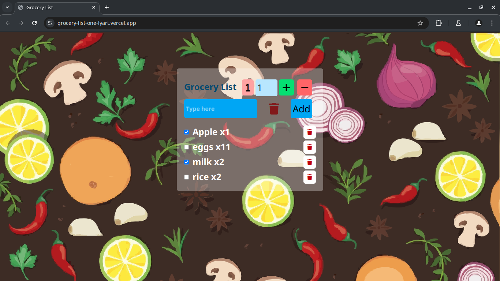

# 🛒 Grocery List Web App

A simple, responsive, and functional Grocery List web application built using **HTML**, **Tailwind CSS**, and **Vanilla JavaScript** and full item management.

---

## 🚀 Features

- ✅ Add grocery items with custom quantities  
- ➕ Increase or ➖ decrease item quantity dynamically  
- 🗑️ Delete individual items from the list  
- 🔄 **Reset** to default values with a single click    
- ❌ **Remove All** button clears the entire list  
- 🧼 Clean and modern UI using Tailwind CSS  
- ⚡ Fast and lightweight – no frameworks required

---

## 🖥️ Technologies Used

- **HTML5**
- **Tailwind CSS**
- **Vanilla JavaScript**

---

## 📸 Screenshot & Preview
[Click here to preview the Music Player](https://grocery-list-one-lyart.vercel.app/)

